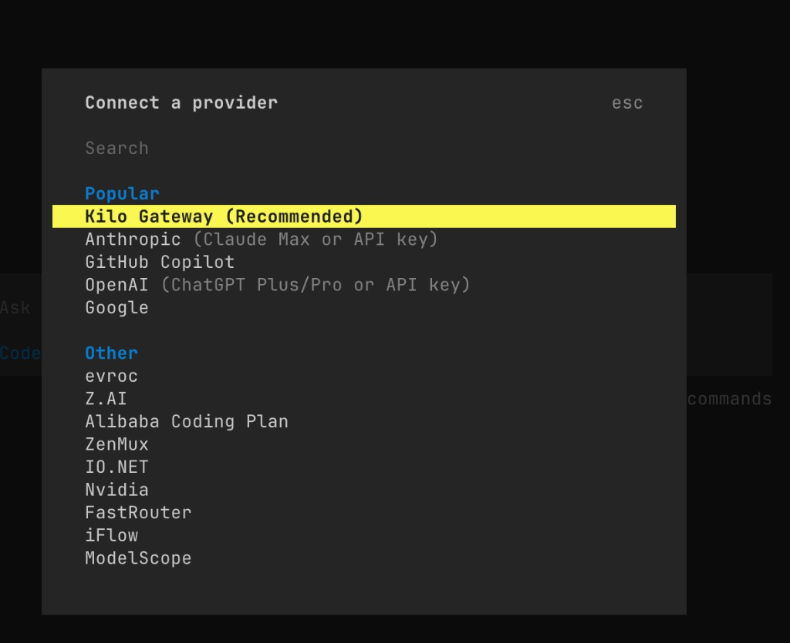

[← Back](../README.md)

# Integrate with Kilo Code

Kilo Code is an AI coding assistant available as a CLI and editor extension.

#### 1. Install Kilo Code CLI

- Install [Node.js](https://nodejs.org/en/download/).
- Run the following command in your terminal to install Kilo Code CLI:

```
npm install -g @kilocode/cli
```

- After installation, run the following command. If the version number is displayed, the installation is successful:

```
kilo --version
```

#### 2. Run Kilo Code

Enter the project directory and run `kilo`:

```
cd /path/to/my-project
kilo
```

<div align="center">

</div>

#### 3. Connect the DeepSeek Provider

- Type `/connect` in the command bar to open the **Connect Provider** panel.

<div align="center">

</div>

- Search for `deepseek`, select **DeepSeek**, then enter your [DeepSeek API Key](https://platform.deepseek.com/api_keys).

<div align="center">

</div>

#### 4. Select a DeepSeek Model

- Type `/models` to open the model selector.
- Select one of the available DeepSeek models:
  - DeepSeek Chat
  - DeepSeek Reasoner
  - DeepSeek V4 Flash
  - DeepSeek V4 Pro

<div align="center">

</div>
